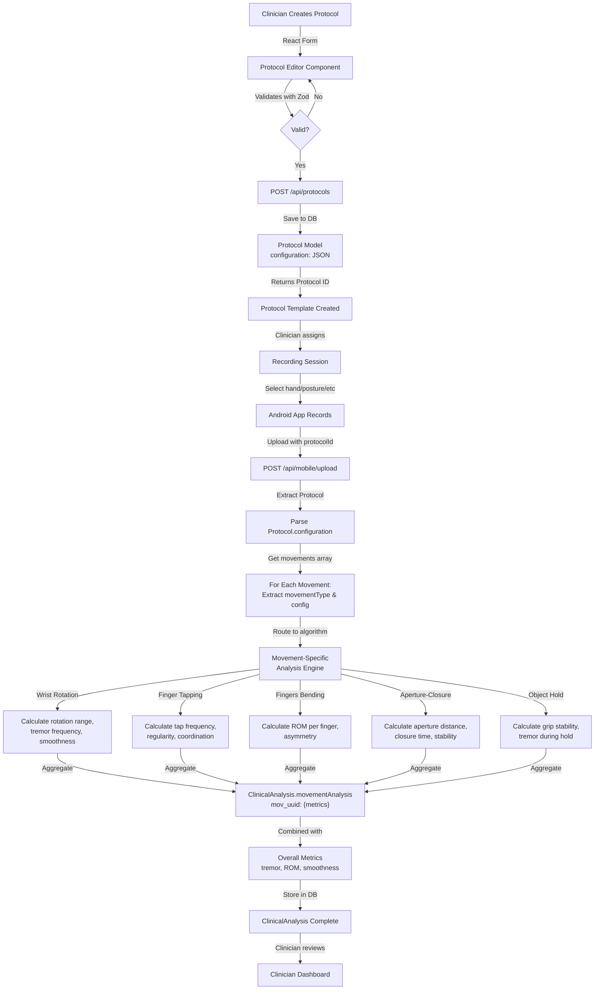
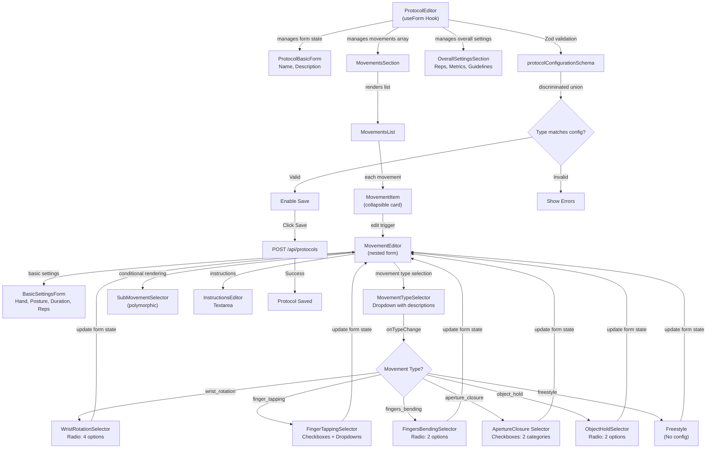
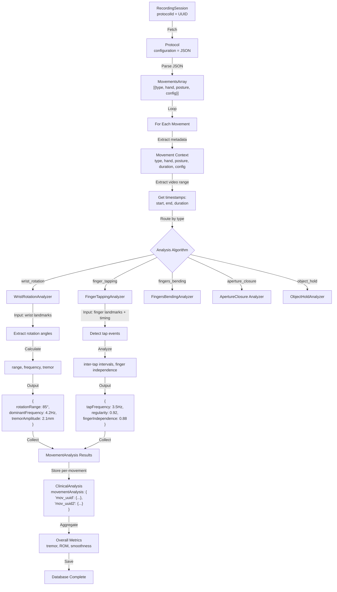
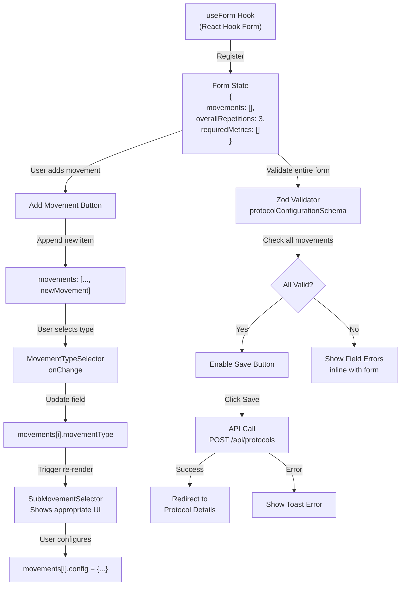
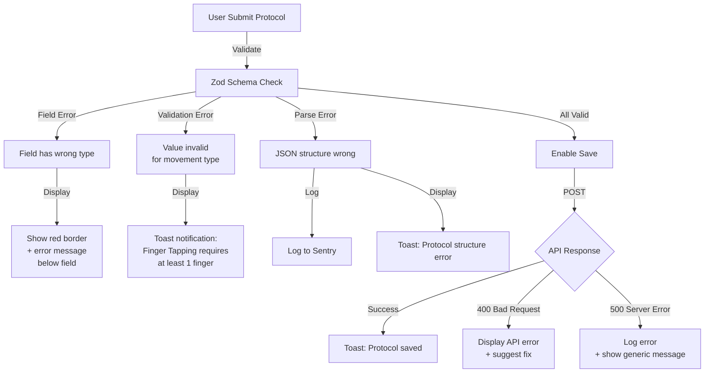

# Protocol Movement System - Architecture Diagrams

## 1. Data Flow: Protocol Creation → Recording → Analysis



---

## 2. Component Hierarchy & Data Flow



---

## 3. Movement Type Decision Tree

```
Select Movement Type
│
├─ Wrist Rotation
│  ├─ Sub-Movement (required)
│  │  ├─ Rotation In-Out
│  │  ├─ Rotation Out-In
│  │  ├─ Rotation In
│  │  └─ Rotation Out
│  └─ Analysis: rotation_range, tremor_during_rotation, smoothness
│
├─ Finger Tapping
│  ├─ Finger Selection (required, min 1)
│  │  ├─ ☐ Thumb
│  │  ├─ ☐ Index
│  │  ├─ ☐ Middle
│  │  ├─ ☐ Ring
│  │  └─ ☐ Little
│  ├─ Unilateral Mode (required)
│  │  ├─ Tap Slowly
│  │  └─ Tap Fast
│  ├─ Bilateral Mode (required)
│  │  ├─ Alternating
│  │  └─ Synchronous
│  └─ Analysis: tap_frequency, regularity, finger_independence, bilateral_coordination
│
├─ Fingers Bending
│  ├─ Sub-Movement (required)
│  │  ├─ Unilateral Hand
│  │  └─ Bilateral Hand
│  └─ Analysis: ROM_per_finger, bending_smoothness, asymmetry
│
├─ Aperture-Closure
│  ├─ Aperture Category (required, select 1)
│  │  ├─ ☐ Aperture
│  │  ├─ ☐ Closure
│  │  └─ ☐ Aperture-Closure
│  ├─ Hand Category (required, select 1)
│  │  ├─ ☐ Unilateral
│  │  └─ ☐ Bilateral
│  ├─ Validation: Must have 1 from each category
│  └─ Analysis: max_aperture, closure_time, aperture_smoothness, stability
│
├─ Object Hold
│  ├─ Sub-Movement (required)
│  │  ├─ Open Palm
│  │  └─ Closed Grasp
│  └─ Analysis: grip_stability, grip_force_estimate, position_stability
│
└─ Freestyle
   ├─ No sub-movements
   └─ Analysis: general_hand_stability, tremor, ROM
```

---

## 4. Validation Flow for Complex Types

```mermaid
graph TD
    A["ProtocolMovement Submitted"] -->|Zod Check| B{movementType?}
    
    B -->|wrist_rotation| B1["Validate WristRotationConfig"]
    B1 -->|subMovement ∈ [4 options]| B1A{Valid?}
    B1A -->|Yes| SUCCESS1["✓ Pass"]
    B1A -->|No| FAIL1["✗ Invalid sub-movement"]
    
    B -->|finger_tapping| B2["Validate FingerTappingConfig"]
    B2 -->|fingers.length ≥ 1| B2A{Check 1}
    B2A -->|✓| B2B{unilateral ∈ enum}
    B2B -->|✓| B2C{bilateral ∈ enum}
    B2C -->|✓| SUCCESS2["✓ Pass"]
    B2C -->|✗| FAIL2["✗ Invalid bilateral"]
    
    B -->|aperture_closure| B3["Validate ApertureClosureConfig"]
    B3 -->|apertureCategory ∈ enum| B3A{Check 1}
    B3A -->|✓| B3B{handCategory ∈ enum}
    B3B -->|✓| SUCCESS3["✓ Pass"]
    B3B -->|✗| FAIL3["✗ Invalid hand category"]
    
    B -->|freestyle| B4["Validate FreestyleConfig"]
    B4 -->|config = {}| SUCCESS4["✓ Pass"]
    
    SUCCESS1 --> COMPLETE["Movement Valid"]
    SUCCESS2 --> COMPLETE
    SUCCESS3 --> COMPLETE
    SUCCESS4 --> COMPLETE
    
    FAIL1 --> ERROR["Show Error to User"]
    FAIL2 --> ERROR
    FAIL3 --> ERROR
```

---

## 5. Database Schema Visualization

```
┌─────────────────────────────────────────────────────────┐
│                    Protocol (Table)                      │
├─────────────────────────────────────────────────────────┤
│ id: UUID (PK)                                            │
│ name: String                                             │
│ description: String (nullable)                           │
│ version: String                                          │
│ configuration: JSON String                              │
│                                                          │
│ ┌──────── configuration JSON Structure ─────────────┐   │
│ │ {                                                  │   │
│ │   "movements": [                                  │   │
│ │     {                                             │   │
│ │       "id": "mov_uuid",                          │   │
│ │       "movementType": "wrist_rotation",          │   │
│ │       "hand": "right",                           │   │
│ │       "posture": "neutral",                      │   │
│ │       "duration": 30,                            │   │
│ │       "repetitions": 5,                          │   │
│ │       "instructions": "...",                     │   │
│ │       "config": {                                │   │
│ │         "subMovement": "rotation_in_out"        │   │
│ │       }                                           │   │
│ │     },                                            │   │
│ │     ... more movements                           │   │
│ │   ],                                              │   │
│ │   "overallRepetitions": 3,                       │   │
│ │   "requiredMetrics": [...],                      │   │
│ │   "clinicalGuidelines": "..."                    │   │
│ │ }                                                 │   │
│ └──────────────────────────────────────────────────┘   │
│                                                          │
│ indicatedFor: String (nullable)                         │
│ contraindications: String (nullable)                    │
│ createdById: UUID (FK → User)                           │
│ isPublic: Boolean                                       │
│ isActive: Boolean                                       │
│ createdAt: DateTime                                     │
│ updatedAt: DateTime                                     │
│ deletedAt: DateTime (nullable, soft delete)             │
└─────────────────────────────────────────────────────────┘
```

---

## 6. Recording → Analysis Pipeline



---

## 7. Frontend Form State Management



---

## 8. Movement Type → Analysis Algorithm Mapping

```
Protocol Creation (Frontend)          →    Recording Analysis (Backend)
─────────────────────────────────────────────────────────────────────

Wrist Rotation                         →    WristRotationAnalyzer
├─ Config: rotationDir                    ├─ Input: Wrist joint landmarks (9)
├─ Hand: left|right|both              ├─ Calculate: angles, velocity
└─ Posture: pronation|supination      └─ Output: range, tremor, smoothness
  │ neutral                             

Finger Tapping                         →    FingerTappingAnalyzer
├─ Config: fingers[], mode, pattern      ├─ Input: Selected finger landmarks
├─ Hand: left|right|both              ├─ Detect: tap events, timing
└─ Posture: ...                       └─ Output: frequency, regularity

Fingers Bending                        →    FingersBendingAnalyzer
├─ Config: unilateral|bilateral          ├─ Input: MCP/PIP joint angles
├─ Hand: ...                          ├─ Calculate: ROM per finger
└─ Posture: ...                       └─ Output: ROM, smoothness, asymmetry

Aperture-Closure                       →    Aperture ClosureAnalyzer
├─ Config: aperture type, hand type      ├─ Input: Hand span, palm angle
├─ Hand: ...                          ├─ Measure: distance, timing
└─ Posture: ...                       └─ Output: aperture, closure time, stability

Object Hold                            →    ObjectHoldAnalyzer
├─ Config: grip type                     ├─ Input: Contact points, hand position
├─ Hand: ...                          ├─ Assess: grip quality, stability
└─ Posture: ...                       └─ Output: stability, tremor, pressure estimate

Freestyle                              →    GeneralHandAnalyzer
├─ Config: {} (none)                     ├─ Input: All hand landmarks
├─ Hand: ...                          ├─ Analyze: general motion
└─ Posture: ...                       └─ Output: ROM, tremor, smoothness
```

---

## 9. Validation Rules Summary

| Movement Type | Mandatory Fields | Validation Rules |
|---|---|---|
| **Wrist Rotation** | `subMovement` | 1 of 4 options |
| **Finger Tapping** | `fingers`, `unilateral`, `bilateral` | min 1 finger, valid modes |
| **Fingers Bending** | `subMovement` | 1 of 2 options |
| **Aperture-Closure** | `apertureCategory`, `handCategory` | 1 from each category (2 total) |
| **Object Hold** | `subMovement` | 1 of 2 options |
| **Freestyle** | (none) | config = {} |

**Global for all movements:**
- `hand`: required, 1 of 3
- `posture`: required, 1 of 3
- `duration`: required, 5-300 seconds
- `repetitions`: required, 1-100
- `instructions`: required, 1-1000 chars

---

## 10. Error Handling Strategy



---

## Summary

This architecture provides:

1. **Type Safety**: Discriminated unions prevent config/type mismatches
2. **Flexibility**: Movement-specific configs and analysis algorithms
3. **Scalability**: Easy to add new movement types
4. **Validation**: Multi-level validation (client-side + server-side)
5. **Clinical Clarity**: Each movement has specific, meaningful metrics
6. **Data Integrity**: Protocol templates stored as immutable snapshots
